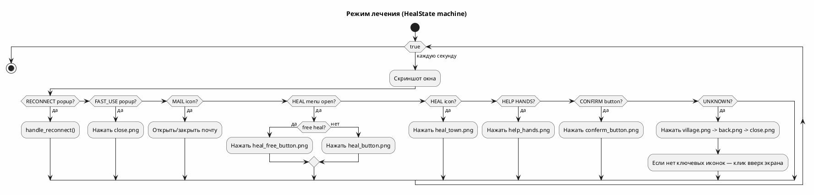
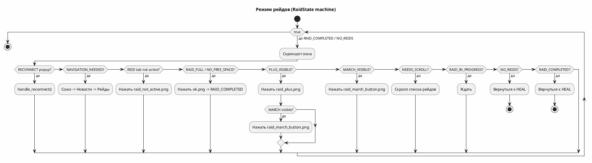
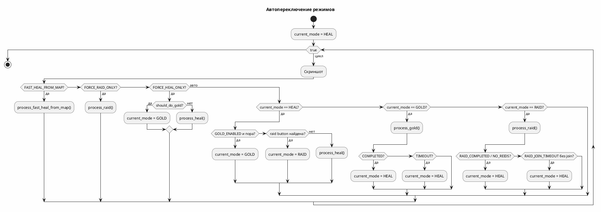
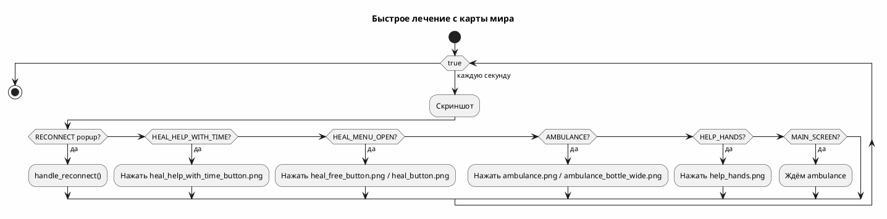
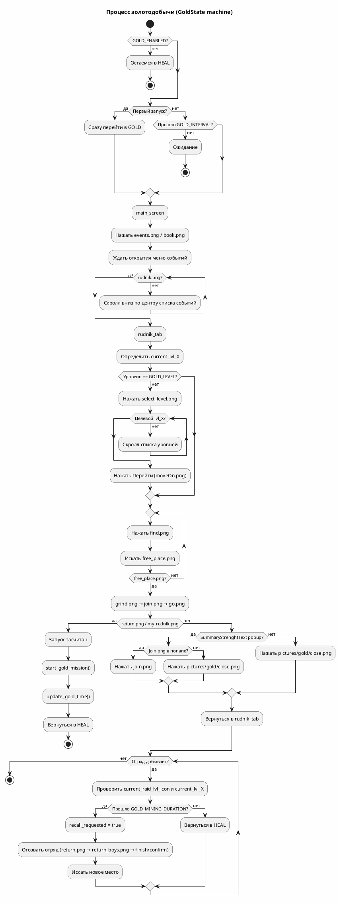

# Heal and Raid Bot

Автоматизированный бот для лечения войск, участия в рейдах и добычи золота в игре через эмулятор BlueStacks.

## Описание

Скрипт автоматически:
- **Лечит войска** — находит и нажимает кнопки лечения, использует бесплатное лечение.
- **Участвует в рейдах** — присоединяется к активным рейдам, управляет маршами.
- **Добывает золото** — автоматизирует событие "Золотодобыча":
  - открывает меню событий и скроллит вниз, пока не найдёт рудник;
  - нажимает иконку рудника, дожидается попапа "Вперёд";
  - переключается на заданный уровень 1–6;
  - ищет свободное место, начинает добычу и отправляет отряд;
  - если отряд уже добывает, проверяет уровень и отзывает его через `GOLD_MINING_DURATION` (по умолчанию 45 минут) для перезапуска.
- **Быстрое лечение с карты мира** — при включённом `FAST_HEAL_FROM_MAP_ENABLED` кликает по иконке ambulance, лечит войска и помогает союзу, игнорируя рейды.
- **Помогает союзу** — кликает по кнопкам помощи, когда доступны.
- **Собирает почту** — забирает награды из почты.
- **Обрабатывает ошибки** — переподключение при разрывах соединения, recovery-последовательности.

## Требования

- **Python 3.8+**
- **Эмулятор BlueStacks** (или аналогичный с именем окна `BlueStacks App Player`)
- **Windows** (используются win32 API для захвата экрана)

## Установка зависимостей

```bash
pip install -r requirements.txt
```

Или вручную:
```bash
pip install numpy opencv-python pyautogui pygetwindow pywin32 pynput
```

## Структура проекта

```
.
├── main.py                      # Точка входа, основной цикл
├── config.py                    # Конфигурация, константы, Enums
├── utils.py                     # Общие утилиты (скриншоты, поиск, окно)
├── heal.py                      # Логика лечения и быстрого лечения с карты
├── raid.py                      # Логика рейдов
├── gold.py                      # Логика золотодобычи
├── heal_and_raid_backup.txt     # Устаревший монолитный файл (не запускать)
├── requirements.txt             # Зависимости
├── README.md                    # Этот файл
├── docs/                        # Документация
│   ├── logic.md                 # Подробная логика стейт-машин
│   ├── GOLD_MODULE.md           # Документация по модулю золота
│   ├── REFACTORING_SUMMARY.md   # Резюме разделения на модули
│   ├── GOLD_REFACTOR.md         # Краткое описание рефакторинга gold.py
│   └── AGENTS.md                # Инструкции для AI-ассистентов
├── archive/                     # Архив старых скриптов
│   ├── addReid.py
│   ├── heal.py
│   └── heal_help.py
├── pictures/                    # Изображения для распознавания
│   ├── common/                  # Общие элементы интерфейса
│   ├── heal/                    # Элементы лечения
│   ├── help/                    # Элементы помощи союзу
│   ├── raid/                    # Элементы рейдов
│   └── gold/                    # Элементы золотодобычи
└── waterbass/                   # Папка с данными (csv, xlsx, скриншоты)
```

## Настройка

### Режимы работы

В файле `config.py` настройте режим работы:

```python
# Только лечение (игнорирует рейды, золото работает)
FORCE_HEAL_ONLY = True
FORCE_RAID_ONLY = False
FAST_HEAL_FROM_MAP_ENABLED = False

# Только рейды (игнорирует лечение)
FORCE_HEAL_ONLY = False
FORCE_RAID_ONLY = True
FAST_HEAL_FROM_MAP_ENABLED = False

# Быстрое лечение с карты мира (высший приоритет)
FORCE_HEAL_ONLY = False
FORCE_RAID_ONLY = False
FAST_HEAL_FROM_MAP_ENABLED = True

# Автопереключение между лечением, рейдами и золотом (по умолчанию)
FORCE_HEAL_ONLY = False
FORCE_RAID_ONLY = False
FAST_HEAL_FROM_MAP_ENABLED = False
```

### Золотодобыча

```python
GOLD_ENABLED = True                 # Включить автоматизацию золотодобычи
GOLD_INTERVAL = 2700                # Интервал между успешными заходами (45 мин)
GOLD_LEVEL = 4                      # Уровень рудника 1–6, на котором работаем
GOLD_MINING_DURATION = 2700         # 45 минут = 2700 сек; после этого отзываем отряд
GOLD_SEARCH_TIMEOUT = 60            # Таймаут поиска рудника (сек)
GOLD_TIMEOUT = 300                  # Максимальное время всего процесса (сек)
GOLD_LEVEL_CONFIDENCE_THRESHOLD = 0.90
GOLD_LIST_LEVEL_CONFIDENCE_THRESHOLD = 0.90
GOLD_LOOP_DELAY = 0.1               # Задержка между итерациями GOLD
GOLD_ACTION_DELAY = 0.05            # Пауза после клика внутри gold
```

### Чувствительность распознавания

| Параметр | Значение | Описание |
|----------|----------|----------|
| `CONFIDENCE_THRESHOLD` | 0.70 | Стандартный порог обнаружения |
| `CONFIDENCE_HIGH` | 0.95 | Высокий порог для критических элементов |
| `CONFIDENCE_MEDIUM_THRESHOLD` | 0.80 | Средний порог |
| `MARCH_THRESHOLD` | 0.90 | Порог кнопки "Марш" |
| `NAVIGATION_THRESHOLD` | 0.90 | Порог навигационных элементов |
| `RAID_JOIN_TIMEOUT` | 120 | Секунды ожидания рейда перед возвратом к лечению |
| `RAID_SCROLL_THRESHOLD` | 2 | Максимум упоминаний "Атака" перед скроллом |

### Подготовка изображений

1. Сделайте скриншоты элементов интерфейса игры.
2. Сохраните их в соответствующие папки:
   - `pictures/common/` — общие элементы (кнопки навигации, почта, события, поселение, союз, новости, помощь и т.д.)
   - `pictures/heal/` — элементы меню лечения
   - `pictures/help/` — элементы помощи союзу
   - `pictures/raid/` — элементы рейдов
   - `pictures/gold/` — элементы золотодобычи

**Важно:** Имена файлов должны совпадать с теми, что указаны в `config.py`.

#### Общие изображения (pictures/common/)

`mail.png`, `conferm_button.png`, `reconnect.png`, `reconnectRepeat.png`, `souz.png`, `news.png`, `village.png`, `wild_earth.png`, `close.png`, `back.png`, `help_hands.png`, `events.png`, `book.png` (альтернативная иконка событий).

#### Лечение (pictures/heal/)

`heal_town.png`, `heal_button.png`, `heal_wait.png`, `heal_help_hands.png`, `heal_free_button.png`, `fast_use.png`, `ambulance.png`, `ambulance_bottle_wide.png`, `heal_help_with_time_button.png`.

#### Рейды (pictures/raid/)

`raid_plus.png`, `raid_march_button.png`, `ok.png`, `raid_active.png`, `raid_not_active.png`, `noFreeSpace.png`, `raid_connect.png`, `raid_connect_2.png`, `attack.png`, `raid_full.png`.

#### Золотодобыча (pictures/gold/)

`rudnik.png`, `rudnik_opened.png`, `forward.png`, `no_free_rudnik.png`, `select_level.png`, `lvl_1.png`...`lvl_6.png`, `current_lvl_1.png`...`current_lvl_6.png`, `current_raid_lvl_icon.png`, `find.png`, `free_place.png`, `grind.png`, `join.png` (work), `go.png`, `moveOn.png`, `my_rudnik.png`, `return.png`, `return_boys.png`, `finish.png`, `confirm.png`, `summary_strength_text.png`, `hand.png`, `close.png`.

## Запуск

```bash
python main.py
```

### Предварительные шаги

1. **Запустите BlueStacks** и откройте игру.
2. **Убедитесь, что окно называется** `"BlueStacks App Player"` (или измените `BLUESTACKS_WINDOW_TITLE` в `config.py`).
3. **Запустите скрипт** — он автоматически активирует окно BlueStacks.

> **Не запускайте** `heal_and_raid.py` — это устаревший монолитный файл, сохранённый для истории.

## Работа скрипта

### Режим лечения



### Режим рейдов



### Автопереключение



### Быстрое лечение с карты мира

При `FAST_HEAL_FROM_MAP_ENABLED = True` скрипт игнорирует рейды и обычное лечение в поселении. Цикл:



### Золотодобыча

В режиме лечения (если `GOLD_ENABLED = True`):
- **При первом запуске скрипта** сразу переключается в режим GOLD.
- **После успешного старта добычи** ждёт `GOLD_INTERVAL` (по умолчанию **45 минут**), затем снова идёт искать место.
- **Активная добыча** длится `GOLD_MINING_DURATION` (по умолчанию **45 минут**), после чего отряд отзывается и бот ищет новое место.
- Выполняет процесс:
  1. Открывает события (`events.png` / `book.png`) и скроллит вниз, пока не найдёт рудник (`rudnik.png`).
  2. Кликает по иконке рудника, ждёт попап с кнопкой "Вперёд" (`forward.png`).
  3. Проверяет текущий уровень (`current_lvl_X`).
  4. При необходимости открывает выбор уровня (`select_level.png`), скроллит список `lvl_X.png` и нажимает "Перейти" (`moveOn.png`) в карточке целевого уровня.
  5. Нажимает "Поиск" (`find.png`), пока не появится `free_place.png`.
  6. grind → work (join.png) → go — отправляет отряд.
  7. Проверяет, что рудник занят (`return.png` / `my_rudnik.png`). Если видна `return.png` без запроса отзыва — запуск успешен.
- Если отряд уже добывает (`my_rudnik.png` / `current_raid_lvl_icon.png`) и прошло `GOLD_MINING_DURATION`, открывает детали, определяет уровень и отзывает отряд (`return.png` → `return_boys.png` → `finish.png` / `confirm.png`).
- При отсутствии свободных мест (`no_free_rudnik.png`) пробует соседние уровни или завершает заход.
- Возвращается к лечению (с таймаутом защиты `GOLD_TIMEOUT`).

> Золотодобыча реализована как **стейт-машина** (`determine_gold_state` + `process_gold`), аналогично лечению и рейдам. Каждая итерация снимает актуальный скриншот и действует исходя из реального состояния экрана.

#### Схема процесса золотодобычи



## Обработка ошибок

- **Переподключение** — автоматическое при разрывах соединения.
- **Окно не найдено** — повторная попытка каждые 5 секунд.
- **Элемент не найден** — продолжение работы без действия.
- **Застревание GOLD** — recovery-последовательность `back.png` → `close.png` → `village.png`.
- **Застревание RAID** — если 30 секунд в терминальном состоянии, клик по центру экрана и возврат к HEAL.

## Отладка

Скриншоты сохраняются в папку `debug_screenshots/` с временными метками:
```
debug_screenshots/
├── 20250101_120000_heal_icon.png
├── 20250101_120015_raid_state.png
├── 20250101_120030_gold_rudnik_tab.png
└── ...
```

Используйте функцию `save_debug_screenshot()` для сохранения состояний интерфейса.

## Логирование

Скрипт выводит детальный лог в консоль:
```
[СИСТЕМА] Запуск Heal and Raid Bot
[СИСТЕМА] Определено окно BlueStacks: region=(100, 100, 1280, 720)
[MAIN] Режим HEAL: last_heal_state=None, current_state=MAIN_SCREEN
[PROCESS_HEAL] Лечение: main_screen
[RAID] Вкладка рейдов НЕ активна (conf=0.923). Требуется клик для активации.
[GOLD] Прошло 3650 сек с последнего рудника. Пора!
[GOLD] Распознан текущий уровень: 4 (conf=0.912)
[GOLD] ✓ Золотодобыча запущена!
```

## Структура кода

### Основные функции

| Функция | Модуль | Описание |
|---------|--------|----------|
| `main()` | `main.py` | Основной цикл работы |
| `process_heal()` | `heal.py` | Обработка состояния лечения |
| `determine_heal_state()` | `heal.py` | Определение текущего состояния лечения |
| `process_fast_heal_from_map()` | `heal.py` | Обработка быстрого лечения с карты мира |
| `determine_fast_heal_from_map_state()` | `heal.py` | Определение состояния быстрого лечения |
| `process_raid()` | `raid.py` | Обработка состояния рейда |
| `determine_raid_state()` | `raid.py` | Определение текущего состояния рейда |
| `process_gold()` | `gold.py` | Обработка одного шага золотодобычи |
| `determine_gold_state()` | `gold.py` | Определение текущего состояния золотодобычи |
| `process_gold_exit()` | `gold.py` | Возврат из рудника в поселение |
| `navigate_to_reid_window()` | `raid.py` | Навигация к окну рейдов |
| `check_and_click_help_button()` | `heal.py` | Проверка и клик кнопки помощи союзу |
| `find_and_click()` | `utils.py` | Поиск элемента и клик по нему |
| `take_screenshot()` | `utils.py` | Создание скриншота области окна |

### Утилиты

| Функция | Описание |
|---------|----------|
| `get_window_region()` | Получение области окна BlueStacks |
| `prepare_template()` | Подготовка шаблона для распознавания |
| `find_on_screen()` | Поиск шаблона на экране |
| `find_all_on_screen()` | Поиск всех вхождений шаблона |
| `swipe_horizontal()` | Горизонтальный свайп в области окна |
| `scroll_in_region()` | Вертикальный скролл в области окна |
| `count_attack_mentions()` | Подсчёт активных рейдов |
| `check_and_scroll_for_attack()` | Скроллинг списка рейдов |
| `should_do_gold()` | Проверка таймера золотодобычи |
| `gold_mission_should_recall()` | Проверка таймера активной добычи |
| `handle_reconnect()` | Обработка переподключения |
| `save_debug_screenshot()` | Сохранение отладочных скриншотов |

## Архитектура (стейт-машины)

Все режимы работы по единому паттерну:
1. **Скриншот** → 2. **Определить состояние** (`determine_*_state`) → 3. **Одно действие** (`process_*`) → 4. **Вернуться в цикл**

Это гарантирует, что даже при неожиданных всплывающих окнах или лагах следующая итерация всегда опирается на реальный текущий экран.

## Состояния

### `MainMode`

| Значение | Описание |
|----------|----------|
| `HEAL` | Лечение / главный режим |
| `RAID` | Рейды |
| `GOLD` | Золотодобыча |

### `HealState`

| Значение | Описание |
|----------|----------|
| `UNKNOWN` | Неизвестное состояние |
| `MAIN_SCREEN` | Главный экран карты / поселения |
| `HEAL_ICON` | Видна иконка лечения в городе |
| `HEAL_MENU_OPEN` | Меню лечения открыто |
| `HEAL_HELP` | Помощь в меню лечения |
| `HEAL_WAIT` | Ожидание лечения |
| `HEAL_TOWN` | Окно города лечения |
| `RECONNECT_POPUP` | Окно переподключения |
| `RECONNECT_REPEAT_POPUP` | Окно повторного переподключения |
| `FAST_USE_POPUP` | Окно быстрого использования |
| `CONFIRM_BUTTON_REQUIRED` | Требуется подтверждение |
| `MAIL` | Почта |
| `HELP_HANDS` | Помощь союзу |
| `AMBULANCE_ON_MAP` | Иконка ambulance на карте мира |
| `HEAL_HELP_WITH_TIME` | Кнопка лечения с таймером |

### `RaidState`

| Значение | Описание |
|----------|----------|
| `UNKNOWN` | Неизвестное состояние |
| `REID_WINDOW_ACTIVE` | Активное окно рейдов |
| `REID_TAB_NOT_ACTIVE` | Вкладка рейдов не активна |
| `PLUS_VISIBLE` | Видна кнопка "+" |
| `MARCH_VISIBLE` | Видна кнопка "Марш" |
| `RAID_IN_PROGRESS` | Рейд выполняется |
| `RAID_COMPLETED` | Рейд завершён |
| `NO_FREE_SPACE` | Нет мест в марше |
| `NO_REIDS` | Нет активных рейдов |
| `RECONNECT_POPUP` | Окно переподключения |
| `RECONNECT_REPEAT_POPUP` | Окно повторного переподключения |
| `NAVIGATION_NEEDED` | Требуется навигация к окну рейдов |
| `NEEDS_SCROLL` | Требуется скролл списка рейдов |
| `RAID_FULL` | Рейд заполнен |

### `GoldState`

| Значение | Описание |
|----------|----------|
| `UNKNOWN` | Не удалось определить экран |
| `MAIN_SCREEN` | Главный экран |
| `EVENTS_MENU_OPEN` | Меню событий открыто, рудник не найден |
| `EVENTS_RUDNIK_VISIBLE` | В меню событий видна иконка рудника |
| `EVENTS_NEED_SCROLL` | Требуется скролл для поиска рудника |
| `FORWARD_POPUP_VISIBLE` | Попап события с кнопкой "Вперёд" |
| `NO_FREE_RUDNIK` | На уровне нет свободных рудников |
| `RUDNIK_TAB` | Открыта таба рудника |
| `SELECT_LEVEL_VISIBLE` | Виден виджет выбора уровня |
| `LEVEL_LIST_VISIBLE` | Открыт список уровней |
| `RAID_LEVEL_ICON_VISIBLE` | Видна иконка активной добычи |
| `FIND_VISIBLE` | Видна кнопка поиска |
| `GRIND_VISIBLE` | Кнопка начала добычи |
| `WORK_VISIBLE` | Кнопка "Работа" |
| `GO_VISIBLE` | Кнопка отправки отряда |
| `MY_RUDNIK_VISIBLE` | Отряд уже добывает |
| `RETURN_CONFIRM_VISIBLE` | Подтверждение отзыва отряда |
| `RETURN_BUTTON_VISIBLE` | Видна кнопка отзыва |
| `FINISH_VISIBLE` | Кнопка завершения после отзыва |
| `CONFIRM_VISIBLE` | Подтверждение после завершения |
| `SUMMARY_STRENGTH_TEXT_VISIBLE` | Попап "место занято" |
| `FREE_PLACE_VISIBLE` | Найдено свободное место |
| `RECONNECT_POPUP` / `RECONNECT_REPEAT_POPUP` | Окна переподключения |
| `COMPLETED` | Процесс завершён |

## Известные ограничения

- **Только Windows** — используются win32 API для захвата экрана.
- **Только BlueStacks** — имя окна жёстко задано (можно изменить).
- **Разрешение** — шаблоны привязаны к конкретному разрешению экрана.
- **Язык игры** — шаблоны зависят от языка интерфейса.

## Документация по разделам

| Файл | Что описывает |
|------|---------------|
| `docs/logic.md` | Детальная логика стейт-машин heal, raid и gold |
| `docs/GOLD_MODULE.md` | Детальный flow процесса золотодобычи |
| `docs/REFACTORING_SUMMARY.md` | Почему `heal_and_raid.py` устарел и как код разделён на модули |
| `docs/GOLD_REFACTOR.md` | Краткое описание рефакторинга `gold.py` в стейт-машину |
| `docs/AGENTS.md` | Инструкции для AI-ассистентов по работе с репозиторием |

## Возможные улучшения

- [x] Рефакторинг `gold.py` в стейт-машину (устойчивость к лагам UI)
- [x] Разделение монолита на модули `heal.py`, `raid.py`, `gold.py`
- [x] Выбор уровня рудника 1–6 и отзыв отряда через 45 минут
- [x] Быстрое лечение с карты мира (`FAST_HEAL_FROM_MAP_ENABLED`)
- [x] Обработка попапа "Вперёд" (`forward.png`) и отсутствия мест (`no_free_rudnik.png`)
- [ ] Добавить поддержку разных разрешений экрана
- [ ] Поддержка других эмуляторов (Nox, LDPlayer)
- [ ] Веб-интерфейс для мониторинга
- [ ] Конфигурационный файл (JSON/YAML)
- [ ] Уведомления при важных событиях

## Лицензия

Используется по вашему усмотрению.

## Предупреждение

Используйте на свой страх и риск. Авторы не несут ответственности за возможные последствия использования скрипта в онлайн-играх. Проверьте правила игры относительно использования ботов и автоматизации.
